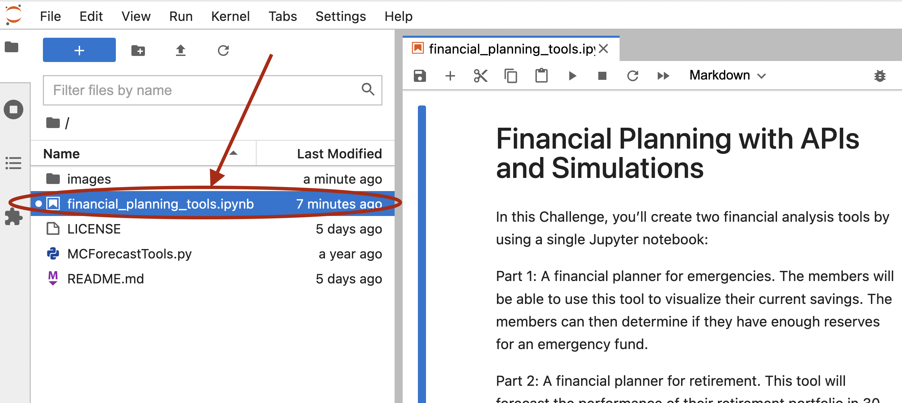

# FinPlan

FinPlan is a financial planning tool for emergencies and for retirement. This financial tool will help members

* visualize their savings and assess whether they have suffecient emergency reserve funds.
* forecast their retirement portfolio's performance in 30 years.

---

## Technologies

* **Pandas** - A python library with advanced financial analysis tools.
* **Jupyter Lab** - An IDE used for visualization.
* **anaconda** - A python framework consisting of several tools used in financial analysis, such as Pandas and Jupyter Lab.
* **alpaca-trade-api** - A python API for stock trading.
* **Requests** - A python library used to interact with APIs.
* **JSON** - A python library that facilitates working with data in JSON format.
* **python-dotenv** - A python library used to configure an environment through key-value pairs stored in a file.
* **MCForecastTools** - A python library that used to run Monte Carlo simulations.

---

## Usage

### Prerequisites
The following are required to use this analytical notebook
* Python 3.7+
* Anaconda
* Jupyter Lab
* Pandas
For instructions on how to install these and how to run Jupyter Lab, please refer to *Installation Guide* found at [Cryptage](https://github.com/CAMPSMITH/cryptage.git)

### Environment variables Needed 
This notebook uses the Alpaca API to obtain stock pricing information.  To use this API, credentials must be configured. It is recommended that the **dotenv** library be used and that these credentials be stored in a **.env** file.  

* Create a file called **.env** in the same folder as the notebook.
* Provide the following in this file as key value pairs:
```
ALPACA_API_KEY = "<YOUR ALPACA API KEY>"
ALPACA_SECRET_KEY = "<YOUR ALPACA API KEY SECRET>"
```
   
### Running the FinPlan Notebook

Once Jupyter Lab has started in your browser, select the **financial_planning_tools.ipynb** notebook from the **Left Sidebar**.



---

## Contributors

*  **Martin Smith** <span>&nbsp;&nbsp;</span> |
<span>&nbsp;&nbsp;</span> *email:* msmith92663@gmail.com <span>&nbsp;&nbsp;</span>|
<span>&nbsp;&nbsp;</span> [](https://www.linkedin.com/in/smithmartinp/)

---

## License

[](LICENSE)